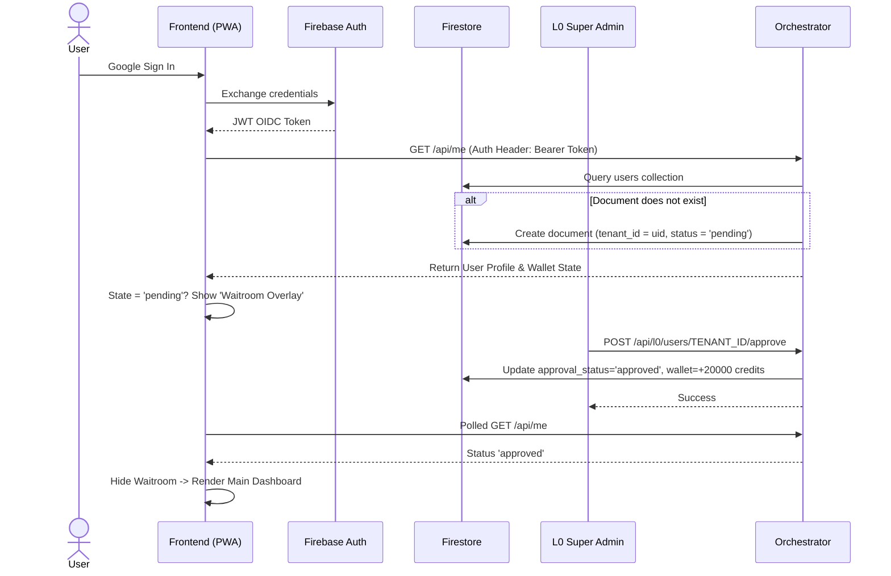
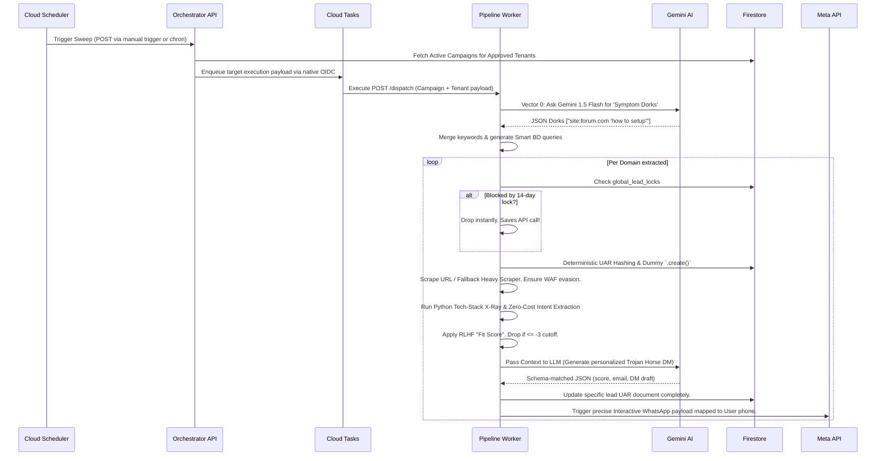

# Sideio Leads V12 - Complete Enterprise Architecture & Developer Handbook

## 1. Executive Summary
Sideio Leads is an enterprise-grade, multi-tenant B2B lead generation platform. It automatically scans the internet based on natural language product descriptions ("bios"), identifies high-value decision-makers, scores their lead quality using Large Language Models (LLMs), and drafts personalized, anti-spam WhatsApp/LinkedIn DMs. The V12 platform operates on an advanced "Bring Your Own Token" (BYOT) architecture, governed by a strict internal credit economy, and powered by an autonomous, zero-cost Python Reinforcement Learning from Human Feedback (RLHF) Loop.

**Developer Onboarding Note:** If you are an intern or new developer, this document is your absolute source of truth. It covers not just the "what," but the *exact implementations*, edge cases, error-handling mechanisms, and data structures.

---

## 2. Infrastructure & Technology Stack

The entire architecture is strictly decoupled and deployed on Google Cloud Platform (GCP).

### 2.1 Core Components
1. **Frontend PWA (`public/`):** A strictly cached, vanilla JavaScript static single-page application hosted securely via Firebase Hosting. We employ zero-dependency UI logic using a dynamic rendering layer for lead cards, along with `Chart.js` for realtime funnel visualization. Caches are physically bypassed dynamically using timestamp parameters (`?rt=...`).
2. **Orchestrator Gateway (`services/orchestrator/`):** Deployed as a scalable Google Cloud Run container. This Python/Flask app handles:
   - REST API gateway matching Firebase Auth tokens (OIDC).
   - L0 Governance Access controls (`/api/l0/...`).
   - RLHF parameter updates to user accounts.
   - Injecting tasks securely into Google Cloud Tasks.
3. **Pipeline Worker (`services/pipeline-main/`):** Deployed autonomously on Cloud Run. It executes asynchronous backend jobs initiated by Cloud Tasks:
   - Multi-Vector Serper AI execution.
   - WAF parsing and smart heuristic checking.
   - Vertex AI (Gemini 2.5 Flash) text processing and scoring.
   - Direct execution of WhatsApp Interactive messages via the Meta Graph API.
4. **Heavy Scraper (`services/scraper-heavy/`):** A fallback microservice handling complex DOM parsing if the primary worker encounters strict Web Application Firewalls (like Cloudflare/Incapsula).

### 2.2 Supporting Infrastructure
*   **Database:** Firebase Firestore (NoSQL Document Store).
*   **Authentication:** Google Identity Platform (Firebase Auth OIDC).
*   **Asynchronous Queuing:** Google Cloud Tasks.
*   **Security & Secrets:** Google Cloud Secret Manager (for API keys). The Orchestrator and Pipeline both use Python's `cryptography.fernet` symmetric encryption internally to securely salt and hash Bring-Your-Own-Token (BYOT) secrets such as Meta WhatsApp access tokens.

---

## 3. Database Schema (Firestore)

A complete understanding of the NoSQL Document Store is required to manipulate data flows safely.

### `users` (or `tenants`)
Manages Identity, L0 Governance, and the internal Economy.
- **`tenant_id`:** [String] Primary key, mapping identically to `uid` returned by Firebase Auth.
- **`email`:** [String] Verified email of the tenant.
- **`role`:** [String] `admin` (standard tenant) or `super_admin` (L0 God Mode capability).
- **`approval_status`:** [String] `pending` or `approved`. Gates UI access.
- **`is_active`:** [Boolean] L0 structural kill-switch. False instantly suspends gateway calls.
- **`beta_expiry`:** [Timestamp] Auto-termination clock for demo access.
- **`wallet`:** [Map] The internal economy.
  - `allocated_credits`: [Int] Total allowed executions.
  - `consumed_credits`: [Int] Used executions incremented atomically via Firestore `Increment`.
- **`preferences_weights`:** [Map] The brain of the RLHF Loop. dynamically registers boolean states for tech stacks: `{"tech_wordpress": 5, "hiring_intent": 12}`.
- **`wa_token`:** [String] User's Meta API Token securely encrypted with Fernet prior to storage.
- **`wa_phone_id`, `admin_phone`:** [String] Meta mapping rules for dynamic alerts.

### `campaigns`
Matrices defining target audiences natively.
- **`id` / `tenant_id`:** [String] Relational joins.
- **`status`:** [String] `active` or `paused`.
- **`name`:** [String] Human-readable identifier.
- **`bio`:** [String] The core natural language product description fed to the LLM.
- **`keywords`:** [String] Seed parameters.
- **`gl`, `location`:** [String] Geo-targeting parameters injected dynamically into Serper.

### `leads`
Target instances after AI processing and exclusivity validation.
- **`id`:** [String] Deterministic Unified Account Resolution (UAR) Hash generated from `SHA256(tenant_id + root_domain)`.
- **`tenant_id`:** [String] Data-silo key.
- **`matched_campaigns`:** [Array] Relates back to search matrices utilizing native `firestore.ArrayUnion`.
- **`url`:** [String] Lead entry doorway.
- **`status`:** [String] `processing`, `new`, `contacted`, `converted`, `ignored`.
- **`score`:** [Int] Vertex AI confidence index (0-10).
- **`interactions`:** [Array] Appended chronologically capturing CRM events `"action"` & `"date"`.
- **`pain_point`, `dm`, `email`, `linkedin`, `phone`:** [String] AI extraction matrices.
- **`tech_stack_found`:** [Array] Array of SaaS dependencies (e.g. `["shopify", "react"]`).
- **`hiring_intent_found`:** [String] Explicit pulse extraction (e.g., "looking for react developers").

### `usage_metrics` 
Telemetry storage per `tenant_id`. Tracked variables include `gemini_calls` and `serper_searches`, used fundamentally for L0 tracking.

### `global_lead_locks`
Cross-tenant exclusivity prevention to block competitor spamming.
- **`id`:** [String] Root level domain (`acme.com`).
- **`locked_until`:** [Timestamp] Hard lock for 14-days per root string.

### `scraped_cache`
Protects against identical requests hitting WAFs or destroying bandwidth.
- **`id`:** [String] URL path (e.g., replacing `/` with `_`).
- **`text`:** [String] Truncated `100KB` body payload enforcing Firestore 1MB limits.
- **`tech_stack`:** [Array] Known technical footprints.

---

## 4. Workflows & Data Flows

### Flow 1: Tenant Registration & L0 Governance

### Flow 2: Pipeline Execution & Autonomous Architecture
The "Quality Moat" process runs entirely in the background, governed by Cloud Tasks.

### Flow 3: Reinforcement Learning from Human Feedback (RLHF)
We employ a mathematically continuous feedback loop without needing explicit model training.
1. The User spots a lead in the dashboard and clicks **"🎯 Converted"** or encounters an alert physically and replies to the Meta webhook.
2. The UI pushes an API mutation to `PUT /api/leads/LEAD_ID {status: 'converted'}`.
3. The Orchestrator catches this mutation. It inspects the `tech_stack_found` (e.g., `["shopify", "stripe"]`) and `hiring_intent_found` (e.g., "React dev needed").
4. It natively modifies `preferences_weights` inside the `users` array via atomic `firestore.Increment(1)` for each corresponding flag.
5. In the future, the Pipeline Worker inherently queries these nested weights. If a URL exhibits `shopify` but mathematically registers poor logic across history (`-3`), the Pipeline statically executes a physical code interrupt `doc_ref.delete()` and drops the Vertex sequence completely, saving explicit computational costs dynamically.

---

## 5. Developer Runbook & Operations

### A. Local Configuration & Deployment
Deployment utilizes Terraformed setups and standardized CLI tools.

1. **Environmental Variables (Crucial):**
    For Orchestrator and Pipeline workers to function, they require these explicit variables inside their Cloud Run containers:
    *   `PROJECT_ID`: e.g. `sideio-leads-v16`.
    *   `QUEUE`: Defines Google Cloud Task integration.
    *   `PIPELINE_URL`: Static mapped address logic natively connecting Gateway -> Worker.
    *   `ENCRYPTION_KEY`: A Fernet compatible salt used globally to strictly sign and interpret payloads like `wa_token`.
    *   `LOCATION`: Generally `asia-south1` or mapping deployment regionality.

2. **Backend Structure:**
    *   Use the `requirements.txt` specifically for the exact dependency matrix (`flask`, `firebase_admin`, `google-cloud-tasks`, `cryptography`, `google-cloud-secret-manager`, `vertexai`, `httpx`, `beautifulsoup4`).
    *   Orchestrator uses Flask, utilizing `@app.before_request` for strict legacy CORS handling to support the PWA.
    *   Pipeline imports `vertexai.generative_models.GenerativeModel("gemini-2.5-flash")` structurally natively.

3. **Frontend Cache Management:**
    *   To forcefully iterate the frontend `index.html` structure past global CDN/Service Worker caches, deploy via Firebase CLI. Use `?v=XX` integer bumping.

### B. Common Use Cases & Tasks an Intern Would Handle
* **L0 Adjustments:** A client requests more beta credits. As an administrator, navigate to the `Super Admin` tab in the PWA, look up their `tenant_id`, enter "5000", and hit `MINT`. This pushes `/api/l0/users/TENANT_ID/mint` scaling the Firestore wallet organically.
* **DPDP / Data Deletion:** A client explicitly revokes usage or ceases subscription. Triggering `POST /purge` immediately queries the `users`, `campaigns`, `leads`, and `scraped_cache` documents filtering explicitly on `tenant_id` and iterates physically utilizing `doc.reference.delete()`.
* **Testing WAF Exceptions:** A target domain continuously breaks. Update the Pipeline logic near line 198 inside `main.py` explicitly appending WAF strings:
  `waf_fingerprints = ["just a moment...", "attention required", "error 1020"]`. This logically triggers the `SCRAPER_HEAVY_URL` natively.
